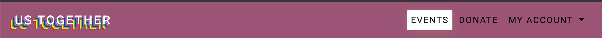
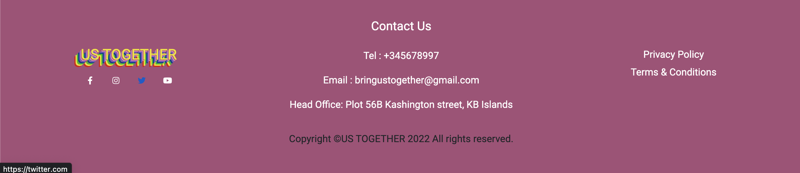
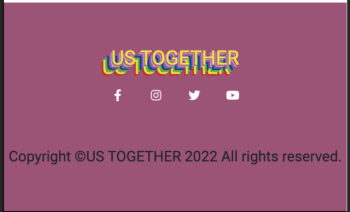

<h1 align="center">Bring Us Together</h1>

[View the live project here.]()

Bring Us Together is a open network where users can create support and contribute to fully inclusive events. Not only by donating to causes which are close to home but also providing a platform to volunteer time and effort to bring about the social change users feel strongly about. 


[View deployed site]()

# **Table of Contents**   
1. [UX Development](#ux-development)
    * [PROJECT GOAL](#project-goal)
      
    * [USER STORIES](#user-stories)
        * [New User](#new-user)
        * [Registered Users/Returning Users](#registered-user-or-returning-users)
        * [Frequent User](#frequent-user)
        * [Target Audience](#target-audience)

   * [DESIGN](#design)
        * [Colour Scheme](#colour-scheme)
        * [Typography](#typography)
        * [Imagery](#imagery)
        * [Wireframes](#wireframes)
        * [Database Structure](#database-structure)

      
2. [Features](#features)  
    * [EXISTING FEATURES](#existing-features) 
        * [General Features On All Pages](#general-features-on-all-pages)
        * [Features To Implement In Future](#features-to-implement-in-future)
      
3. [Technology Used](#technology-used)  
    * [Language Used](#language-used) 
    * [Frameworks & libraries](#frameworks-libraries)
    * [Packages/Dependencies Installed](#packages-dependencies-installed)
    * [Database Management](#database-management)
    * [Payment Service](#payment-service)
    * [Storage & Hosting](#storage-hosting)


4. [Testing](#testing)   
    * [TEST.md](#testing)   

5. [DEPLOYMENT](#deployment)
    * [How to Use Project](#how-to-use-project)
    * [Project Set Up](#project-set-up)
    * [Deployment To Heroku](#deployment-to-heroku)
    * [AWS And S3 Bucket Setup](#aws-and-s3-bucket-setup)
    * [Connect Django To AWS Bucket](#connect-django-to-aws-bucket)

7. [Credits](#credits)  
    * [Content](#content) 
    * [Media](#media)  
 
8. [Acknowledgements](#acknowledgements)
    * [Team Members](#team-members)


## **UX Development**
### **PROJECT GOAL**

GOAL OF PROJECT 
## **User Stories***
### **New User**
* As a First Time Visitor, I want to instantly understand the site's purpose.
* As a First Time Visitor, I want to be able to navigate throughout the site seamlessly.
* As a First Time Visitor, I want donating to a given given event/charity to be clear and easy to do.
* As a First Time Visitor, I want to see examples of past / successful events. 
* As a First Time Visitor, I want to be able to understand the positive role the site plays

### **Registered User/Returning Users**

* As a Returning Visitor, I want to connect to like minded people / organisations.
* As a Returning Visitor, I want to organise my own event.
* As a Returning Vistior, I want to be able to sign up / register and have a clear path to do so.
### **Frequent User**

* As a Frequent User, I want to be able to follow and stay updated on events / causes that I'm interested in.
* As a Frequent User, I want to check to see if there are any new events I haven't seen previously.
* As a Frequent User, I want to be able to have an overview of my own organised events.
* As a Frequent User, I want to be able to not only donate money but my own time, to causes I am passionate about.

### **Target Audience**
* LGBTQ indivual who are looking to create events/ attend events to connect with new people.

* Individuals looking to support / make an impact in the LGBTQ community. 

* Individuals who want to learn and support the LGBTQ community.
## **DESIGN**
### **Colour Scheme**
The colours used in the design of US Together were obtained from the [Adobe Color website](https://color.adobe.com/). The colours were inspired by a mix of rainbow colours which signify diversity while encouraging togetherness. A strong symbol of the LGBTQ+ community in order to build trust with our brand and stimulate their curiosity by using aesthetically pleasing images that catch our users' attention and provide a welcoming safe haven.

  
### **Typography**
The [Google Fonts](https://fonts.google.com) Roboto and Montserrat font were chosen for their bold and clean nature to give the site a friendly clean minimalist design. A backup font has also been included sans-serif.

### **Imagery**
Imagery is important. The large, background hero image is designed to be striking and catch the user's attention. It also has a modern, energetic aesthetic.
### **Wireframes**

The entire site's wireframe was done using [Figma](https://www.figma.com) & Balmasiq.This depicts the site on a desktop and a mobile device.

* [Wireframe for Home Page](readme-files/read-me/wireframes/homepage.png) 
* [Wireframe for Event Page](readme-files/read-me/wireframes/events-page.png)   
* [Wireframe for Event Detail Page](readme-files/read-me/wireframes/event-detail.png)
* [Wireframe for Donation Page](readme-files/read-me/wireframes/donationpage.png)    
* [Wireframe for Login Page](readme-files/read-me/wireframes/loginpage.png)

### **Database Structure**

[Diagram.io](https://dbdiagram.io/home) was used to create the data schema for this project. Our schema had three collections:

  

## **Features**

### **General Features On All Pages**

The site has been designed to be fully responsive, across all devices and has been designed to be user-friendly and intuitive.

**Navbar**

The site has a fully responsive navbar on all pages .




**Footer**

This contains US Together social media accounts, where users may discover more about them and create trust with the brand. It also provides conatct details of the business and it's Terms of service.




**Favicon**

The Favicon was created using [Favicon.io](https://favicon.io/).We chose the hero image as our favicon as it brings brand cohesion to the site.

**Modal**
On some sites, a modal appears to allow the user to conduct basic operations such as adding events, making donations and deleting events. 

### **FEATURES TO IMPLEMENT IN FUTURE**  

*  **Privacy, Terms and Condition Page** : Provides the users with explicit details about our wesbite , how our data is collected and how we protect their data. 

<br/>   
  
# **Technology Used**
### **LANGUAGE USED** 

-   [HTML5](https://en.wikipedia.org/wiki/HTML5)
-   [CSS3](https://en.wikipedia.org/wiki/Cascading_Style_Sheets)
-   [Python](https://en.wikipedia.org/wiki/Python_(programming_language))
-   [JavaScript](https://en.wikipedia.org/wiki/JavaScript)

### **FRAMEWORKS & LIBRARIES**   
   * [Django Template](https://jinja.palletsprojects.com) : Django used this as a templating language to display backend data on the frontend.

   * [BOOTSTRAP 5.0](https://getbootstrap.com/docs/5.0/):  This was used to help with the website's structure, style, and responsiveness across all devices.

   * [jQuery 3.6.0](https://jquery.com/) : This is a JavaScript library that makes it possible to write less JavaScript code.

   * [Fontawesome](https://fontawesome.com/) : This was used to convey information using icons and to improve the site's appearance.

   * [Google Fonts](https://fonts.google.com/) : For this project's design, the fonts Roboto and Source Sans Pro have been imported into the stylesheet.

   * [GITHUB](https://github.com/) : This was the location of the project's code.

### **PACKAGES/ DEPENDENCIES INSTALLED** 

   * [Django Allauth](https://django-allauth.readthedocs.io/en/latest/) : This was used to verify users' identities, register them, and manage their accounts.  

   * [Gunicorn](https://gunicorn.org/) : This is an HTTP server for WSGI applications that will be used to aid in the deployment of the project.

   * [Pillow](https://pypi.org/project/Pillow/) : This is a Python imaging library for processing and manipulating images.

### **DATABASE MANAGEMENT**

   * [SQLite](https://www.sqlite.com/index.html) : This served as our database for development.  

   * [Heroku Postgres](https://www.heroku.com/postgres) :  This was used for our Heroku database in production.  

### **PAYMENT SERVICE** 
   * [Stripe]https://dashboard.stripe.com/): This was used to process payments on the website. 

### **STORAGE & HOSTING**  
   * [Amazon Web Service S3](https://aws.amazon.com/s3/) :This was used in production to host all of our static and media files.

   * [Heroku](https://en.wikipedia.org/wiki/Heroku) : This was our preferred cloud platform for deploying our project.

   * [GITHUB](https://github.com/) : This was our preferred cloud platform for deploying our project.

### **OTHER TOOLS**  

   * [FIGMA](https://www.figma.com/) : This was used to create wireframes (mobile, ipad and desktop devices).

   * [Balsamiq:](https://balsamiq.com/) : Balsamiq was used to create the [wireframes](https://github.com/) during the design process.

   * [GIT](https://git-scm.com/) : This was the preferred method of version control. To commit and publish our project to GitHub, we used the gitpod.

   * [Favicon.io](https://favicon.io/favicon-converter/) : This is a Favicon maker that was used to create the MMÀ-HAIRCARE favicon. 

   * [JSHint](https://jshint.com/) : This was used to analyse the JavaScript code and ensure that all errors were minimised. 

   * [PEP8](http://pep8online.com/) : This was used to run our Python code to ensure it was free of errors.

   * [CHROME DEV TOOLS]() : This was used to test the responsiveness of our website across different screen sizes.

   * [dbdiagram.io](dbdiagram.io) : This was used to create our database schema. 

   * [Adobe Color](https://color.adobe.com/): This was used to select the site's colour scheme.

   * [TinyPNG](https://tinyjpg.com/): This is an image compressor that is used to compress all images.


## Testing

Please view our [TESTING.md](testing.md) file for more information on the testing undertaken.


### Further Testing

-   The Website was tested on Google Chrome, Internet Explorer, Microsoft Edge and Safari browsers.
-   The website was viewed on a variety of devices such as Desktop, Laptop, iPhone7, iPhone 8 & iPhoneX.
-   A large amount of testing was done to ensure that all pages were linking correctly.
-   Friends and family members were asked to review the site and documentation to point out any bugs and/or user experience issues.

### Known Bugs

-   On some mobile devices the Hero Image pushes the size of screen out more than any of the other content on the page.
    -   A white gap can be seen to the right of the footer and navigation bar as a result.
-   On Microsoft Edge and Internet Explorer Browsers, all links in Navbar are pushed upwards when hovering over them.


### Testing User Stories from User Experience (UX) Section


## **Deployment**

### **Deployment Heroku**

This project was deployed using Heroku:

1. Create a new app with the name found-in-translation.
2. Linked the found-in-translation app to its Github repository.
3. Verify that the project has an up to date Procfile and requirements.txt
4. Push the project to the Heroku remote.
5. Set the SECRET_KEY environmental variable in the Heroku config vars.
6. Set the IP to 0.0.0.0 and the PORT to 5000 in the Heroku config vars.
7. Set the MONGO_URI environmental variable in the Heroku config vars.
8. Restart all dynos.
9. Open the app on Heroku and check to ensure that it's working correctly.

### **How to clone**

1. Log in to GitHub and locate the [GitHub Repository](https://github.com/)
2. Under the repository name, click "Clone or download".
3. To clone the repository using HTTPS, under "Clone with HTTPS", copy the link.
4. Open Git Bash
5. Change the current working directory to the location where you want the cloned directory to be made.
6. Type `git clone`, and then paste the URL you copied in Step 3.

```
$ git clone https://github.com/YOUR-USERNAME/YOUR-REPOSITORY
```

7. Press Enter. Your local clone will be created.

```
$ git clone https://github.com/YOUR-USERNAME/YOUR-REPOSITORY
> Cloning into `CI-Clone`...
> remote: Counting objects: 10, done.
> remote: Compressing objects: 100% (8/8), done.
> remove: Total 10 (delta 1), reused 10 (delta 1)
> Unpacking objects: 100% (10/10), done.
```

Click [Here](https://help.github.com/en/github/creating-cloning-and-archiving-repositories/cloning-a-repository#cloning-a-repository-to-github-desktop) to retrieve pictures for some of the buttons and more detailed explanations of the above process.

### **How to Fork**

By forking the GitHub Repository we make a copy of the original repository on our GitHub account to view and/or make changes without affecting the original repository by using the following steps...

1. Log in to GitHub and locate the [GitHub Repository](https://github.com/)
2. At the top of the Repository (not top of page) just above the "Settings" Button on the menu, locate the "Fork" Button.
3. You should now have a copy of the original repository in your GitHub account.


## **Credits**
### **Content**

-   All content was written by the developers.

-   Psychological properties of colours text in the README.md was found [here](http://www.colour-affects.co.uk/psychological-properties-of-colours)

-   The full-screen hero image code came from this [StackOverflow post](https://stackoverflow.com)

- The carousel images were sourced from [pexels](https://www.pexels.com/)

-   [Bootstrap4](https://getbootstrap.com/docs/4.4/getting-started/introduction/): Bootstrap Library used throughout the project mainly to make site responsive using the Bootstrap Grid System.

-   [MDN Web Docs](https://developer.mozilla.org/) : For Pattern Validation code. Code was modified to better fit my needs and to match an Irish phone number layout to ensure correct validation. Tutorial Found [Here](https://developer.mozilla.org/en-US/docs/Web/HTML/Element/input/tel#Pattern_validation)

### **Media**
All images were obtained from 
## **Acknowledgements**

* Thank you to Code Institute for putting together this hackathon - we have had an amazing time taking part.
## **Team Members**

* Name  [LinkedIn]() | [Github]()

""

* . []() | [Github](\)

"_"

* Didi [LinkedIn](https://www.linkedin.com/in/onyema-onyejekwe-492128102/) | [Github](https://github.com/Didisimmons)

"_Participating in the June 2022 Hackathon organized by Code Institute was an incredible experience. Thank you for this wonderful opportunity; the last few days have been simply incredible; I got to work with and learn from talented individuals, build my network skills, improve my collaborative skills, and have fun with my new friends while working on our exciting project. I'm looking forward to participating in many more hackathons in the future._"

* [LinkedIn]() | [Github]()

""

*  [LinkedIn]() | [Github]()

"". 