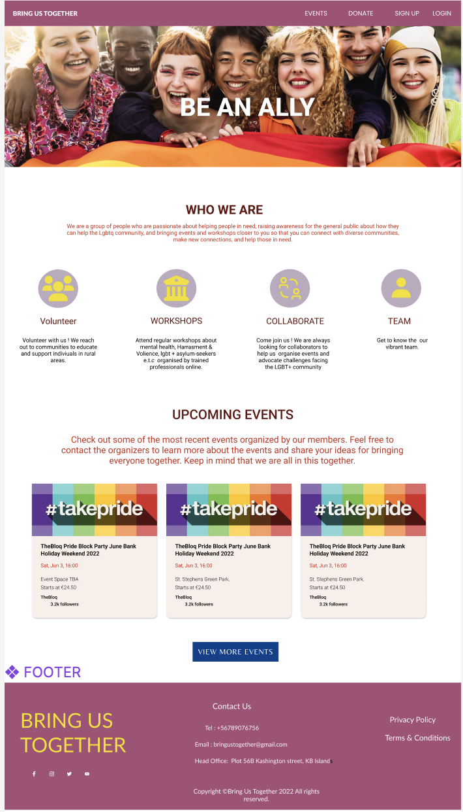

<h1 align="center">Bring Us Together</h1>

[View the live project here.](https://pride-hackathon-team3.herokuapp.com/)

Bring Us Together is a open network where users can create support and contribute to fully inclusive events. Not only by donating to causes which are close to home but also providing a platform to volunteer time and effort to bring about the social change users feel strongly about. 


[View deployed site]()

# **Table of Contents**   
1. [UX Development](#ux-development)
    * [PROJECT GOAL](#project-goal)
      
    * [USER STORIES](#user-stories)
        * [New User](#new-user)
        * [Registered Users/Returning Users](#registered-user-or-returning-users)
        * [Frequent User](#frequent-user)
        * [Target Audience](#target-audience)

   * [DESIGN](#design)
        * [Colour Scheme](#colour-scheme)
        * [Typography](#typography)
        * [Imagery](#imagery)
        * [Wireframes](#wireframes)
        * [Database Structure](#database-structure)

      
2. [Features](#features)  
    * [EXISTING FEATURES](#existing-features) 
        * [General Features On All Pages](#general-features-on-all-pages)
        * [Features To Implement In Future](#features-to-implement-in-future)
      
3. [Technology Used](#technology-used)  
    * [Language Used](#language-used) 
    * [Frameworks & libraries](#frameworks-libraries)
    * [Packages/Dependencies Installed](#packages-dependencies-installed)
    * [Database Management](#database-management)
    * [Payment Service](#payment-service)
    * [Storage & Hosting](#storage-hosting)


4. [Testing](#testing)   
    * [TEST.md](#testing)   

5. [DEPLOYMENT](#deployment)
    * [How to Use Project](#how-to-use-project)
    * [Project Set Up](#project-set-up)
    * [Deployment To Heroku](#deployment-to-heroku)
    * [AWS And S3 Bucket Setup](#aws-and-s3-bucket-setup)
    * [Connect Django To AWS Bucket](#connect-django-to-aws-bucket)

7. [Credits](#credits)  
    * [Content](#content) 
    * [Media](#media)  
 
8. [Acknowledgements](#acknowledgements)
    * [Team Members](#team-members)


## **UX Development**
### **PROJECT GOAL**

GOAL OF PROJECT 
## **User Stories***
### **New User**
* As a First Time Visitor, I want to instantly understand the site's purpose.
* As a First Time Visitor, I want to be able to navigate throughout the site seamlessly.
* As a First Time Visitor, I want donating to a given given event/charity to be clear and easy to do.
* As a First Time Visitor, I want to see examples of past / successful events. 
* As a First Time Visitor, I want to be able to understand the positive role the site plays

### **Registered User/Returning Users**

* As a Returning Visitor, I want to connect to like minded people / organisations.
* As a Returning Visitor, I want to organise my own event.
* As a Returning Vistior, I want to be able to sign up / register and have a clear path to do so.
### **Frequent User**

* As a Frequent User, I want to be able to follow and stay updated on events / causes that I'm interested in.
* As a Frequent User, I want to check to see if there are any new events I haven't seen previously.
* As a Frequent User, I want to be able to have an overview of my own organised events.
* As a Frequent User, I want to be able to not only donate money but my own time, to causes I am passionate about.

### **Target Audience**
* LGBTQ indivual who are looking to create events/ attend events to connect with new people.

* Individuals looking to support / make an impact in the LGBTQ community. 

* Individuals who want to learn and support the LGBTQ community.
## **DESIGN**
### **Colour Scheme**
The colours used in the design of US Together were obtained from the [Adobe Color website](https://color.adobe.com/). The colours were inspired by a mix of rainbow colours which signify diversity while encouraging togetherness. A strong symbol of the LGBTQ+ community in order to build trust with our brand and stimulate their curiosity by using aesthetically pleasing images that catch our users' attention and provide a welcoming safe haven.

  
### **Typography**
The [Google Fonts](https://fonts.google.com) Roboto and Montserrat font were chosen for their bold and clean nature to give the site a friendly clean minimalist design. A backup font has also been included sans-serif.

### **Imagery**
Imagery is important. The large, background hero image is designed to be striking and catch the user's attention. It also has a modern, energetic aesthetic.
### **Wireframes**

The entire site's wireframe was done using [Figma](https://www.figma.com) & Balmasiq.This depicts the site on a desktop and a mobile device.

 
   

    


### **Database Structure**

[Diagram.io](https://dbdiagram.io/home) was used to create the data schema for this project. Our schema had three collections:

  

## **Features**
### **General Features On All Pages**

The site has been designed to be fully responsive, across all devices and has been designed to be user-friendly and intuitive.

**Navbar**

The site has a fully responsive navbar on all pages .


**Footer**

This contains US Together social media accounts, where users may discover more about them and create trust with the brand. It also provides conatct details of the business and it's Terms of service.


**Favicon**

The Favicon was created using [Favicon.io](https://favicon.io/).We chose the hero image as our favicon as it brings brand cohesion to the site.

**Modal**

On some sites, a modal appears to allow the user to conduct basic operations such as adding events, making donations and deleting events. 

### **FEATURES TO IMPLEMENT IN FUTURE**  

*  **Privacy, Terms and Condition Page** : Provides the users with explicit details about our wesbite , how our data is collected and how we protect their data. 

<br/>   
  
# **Technology Used**
### **LANGUAGE USED** 

-   [HTML5](https://en.wikipedia.org/wiki/HTML5)
-   [CSS3](https://en.wikipedia.org/wiki/Cascading_Style_Sheets)
-   [Python](https://en.wikipedia.org/wiki/Python_(programming_language))
-   [JavaScript](https://en.wikipedia.org/wiki/JavaScript)

### **FRAMEWORKS & LIBRARIES**   
   * [Django Template](https://jinja.palletsprojects.com) : Django used this as a templating language to display backend data on the frontend.

   * [BOOTSTRAP 5.0](https://getbootstrap.com/docs/5.0/):  This was used to help with the website's structure, style, and responsiveness across all devices.

   * [jQuery 3.6.0](https://jquery.com/) : This is a JavaScript library that makes it possible to write less JavaScript code.

   * [Fontawesome](https://fontawesome.com/) : This was used to convey information using icons and to improve the site's appearance.

   * [Google Fonts](https://fonts.google.com/) : For this project's design, the fonts Roboto and Source Sans Pro have been imported into the stylesheet.

   * [GITHUB](https://github.com/) : This was the location of the project's code.

### **PACKAGES/ DEPENDENCIES INSTALLED** 

   * [Django Allauth](https://django-allauth.readthedocs.io/en/latest/) : This was used to verify users' identities, register them, and manage their accounts.  

   * [Gunicorn](https://gunicorn.org/) : This is an HTTP server for WSGI applications that will be used to aid in the deployment of the project.

   * [Pillow](https://pypi.org/project/Pillow/) : This is a Python imaging library for processing and manipulating images.

### **DATABASE MANAGEMENT**

   * [SQLite](https://www.sqlite.com/index.html) : This served as our database for development.  

   * [Heroku Postgres](https://www.heroku.com/postgres) :  This was used for our Heroku database in production.  

### **PAYMENT SERVICE** 
   * [Stripe]https://dashboard.stripe.com/): This was used to process payments on the website. 

### **STORAGE & HOSTING**  
   * [Amazon Web Service S3](https://aws.amazon.com/s3/) :This was used in production to host all of our static and media files.

   * [Heroku](https://en.wikipedia.org/wiki/Heroku) : This was our preferred cloud platform for deploying our project.

   * [GITHUB](https://github.com/) : This was our preferred cloud platform for deploying our project.

### **OTHER TOOLS**  

   * [FIGMA](https://www.figma.com/) : This was used to create wireframes (mobile, ipad and desktop devices).

   * [Balsamiq:](https://balsamiq.com/) : Balsamiq was used to create the [wireframes](https://github.com/) during the design process.

   * [GIT](https://git-scm.com/) : This was the preferred method of version control. To commit and publish our project to GitHub, we used the gitpod.

   * [Favicon.io](https://favicon.io/favicon-converter/) : This is a Favicon maker that was used to create the our favicon. 

   * [JSHint](https://jshint.com/) : This was used to analyse the JavaScript code and ensure that all errors were minimised. 

   * [PEP8](http://pep8online.com/) : This was used to run our Python code to ensure it was free of errors.

   * [CHROME DEV TOOLS]() : This was used to test the responsiveness of our website across different screen sizes.

   * [dbdiagram.io](dbdiagram.io) : This was used to create our database schema. 

   * [Adobe Color](https://color.adobe.com/): This was used to select the site's colour scheme.

## Testing

Please view our [TESTING.md](testing.md) file for more information on the testing undertaken.

# **Deployment**
This project was created with Gitpod as the IDE, committed to git as its local repository, and is hosted on Github. The project is deployed using a free hosting service (Heroku).

To Deploy US Together the following are needed 
   -	A Heroku account  
   -	A github account 


### **How To Use Project**   
In the event that a user wishes to fork the project or clone the project, the necessary steps are also provided below.

#### **Forking the repository**  
1. Sign in to your GitHub account.  
2. Locate the repository to be duplicated, in this case US together.  
3. Locate and click the “Fork” button at the top of the  US together. 
4. This creates a copy of the repository in our account and allows us to make changes.

#### **Making A Local Clone of Github Repository**   

1. Locate the desired repository in this case US together, under the repository name click Clone or download.

2. Click it and copy the HTTPS link that appears.

3.	Activate your local IDE terminal.

4.	Change the current working directory to the location where you wish the cloned file to be saved.

5.	In the terminal, type “git clone” and then paste the link copied from HTTPS.  
```$ git clone https://github.com/YOUR-USERNAME/YOUR-REPOSITORY```

6. Press Enter and  your local clone is created.

7. Create a new env.py file in the base directory and include the following code.
```
import os
#Django
os.environ.setdefault( 'DEVELOPMENT', 'True')
os.environ.setdefault('SECRET_KEY', '<YOUR_KEY>')

```
8. Ensure that the env.py file is located in the .gitignore file.

9. Type the following into the terminal to install our required dependencies and modules.
      ```pip3 install -r requirements.txt```


#### **Project Set Up** 
After forking or cloning the US together repository, the following steps must be completed in order for our github repository to be deployed to Heroku.
1.  Ensure that all US together dependencies are installed and operational. The gitignore file contains all of the necessary hidden files.

2. Go to your gitpod workspace after installing the necessary dependencies. Variables can be found under Settings - --> Variables. Enter the following project environment variables:
   Varables | Key   
   ---| ---   
   DEVELOPMENT | TRUE   
   SECRET_KEY | <your_secret_key>  
   STRIPE_PUBLIC_KEY | <your_secret_key>  
   STRIPE_SECRET_KEY | <your_secret_key>   
   STRIPE_WH_KEY | <your_secret_key>

   These keys can be obtained from  
      -	The SECRET_KEY from [Django Secret Key Generator](https://miniwebtool.com/django-secret-key-generator/) 
      -	By creating an account, you can obtain the STRIPE PUBLIC KEY and STRIPE SECRET KEY. This is located in the 'Developers' section (API KEY). 
      - The STRIPE WH KEY can be obtained from the 'Webhooks' section of the 'Developers' section. After you've navigated to 'Webhooks,' click "Add new endpoint." Insert your endpoint URL here ``` https://<your_host_url>/checkout/wh/. ``` 
      To listen to events, select payment.intent.success and payment.intent.failed, and then create an endpoint. STRIPE WH KEY can be revealed once it has been created.

3. Make migrations to keep our database up to date.

4. We can now run the server and deploy after it has been updated.


### **Deployment To Heroku**

1. Create a new Heroku App
   - Sign in or create a Heroku account. After logging in, click "Create new app" in the top right corner of your dashboard.

   - Give your app a unique name and use a hyphen between words.

   - Select a region near you and then click Create App.

2. Navigate to the resources tab on the app dashboard, search for "Heroku Postgres" under Add-ons, select it, and then select the free plan.

3. On Heroku's Dashboard, Under settings, click the "Reveal Configure vars" button and enter the required configuration variables, including those whose values may not yet be present. The unavailable values would be updated as you progress through the steps.
      Varables | Key   
      ---| ---   
      AWS_ACCESS_KEY_ID | your access aws key 
      AWS_SECRET_ACCESS_KEY| Your secret access aws key  
      DATABASE_URL| Your database url   
      EMAIL_HOST_PASS | Your app password
      EMAIL_HOST_USER | Your email address  
      SECRET_KEY | Your secret key
      STRIPE_PUBLIC_KEY | Your stripe public key 
      STRIPE_SECRET_KEY | Your stripe secret key
      USE_AWS | True

4. Return to your project's Gitpod IDE and use the CLI to install the following important files: 
   ```
   pip3 install dj_database_url
   pip3 install psycopg2-binary
   ```
   - Once the requirements have been created, we must freeze them in our CLI pip3 freeze > requirements.txt to ensure that Heroku instals our app when it is deployed.

   - Create a new database for US together by importing dj database url into our settings.py file and commenting out our default configuration. We would need to replace the default database with a call to dj database url.parse and pass it the database URL from Heroku (which can be found in our app settings tab's config variables).
      ```
      DATABASES = {
      'default': dj_database_url.parse('YOUR_DATABASE_URL_FROM_HEROKU')
      }
      ```
   - Run migrations
      ```
      python3 manage.py migrate
      ```
5. To load our product data from the fixtures folder to our deployed US together site, we must first load the category data before the product data because the products rely on the existing category.
   ```
   python3 manage.py loaddata categories
   python3 manage.py loaddata products
   ```

6. Create a new super user to log in with and provide details for the username and password.
   ```
   python3 manage.py create superuser
   ```

7. Remove the Heroku database URL from our settings.py file and uncomment the default database configuration. Add an if statement to specify that if the app is running on Heroku, it should connect to Postgres; otherwise, it should connect to Sqlite.

```
   if 'DATABASE_URL' in os.environ:
      DATABASES = {
         'default': dj_database_url.parse(os.environ.get('DATABASE_URL'))
      }
   else:
      DATABASES = {
         'default': {
            'ENGINE': 'django.db.backends.sqlite3',
            'NAME': BASE_DIR / 'db.sqlite3',
         }
      }
   ```  

8. Once we've created our conditional statement, we'll need to install Gunicorn, which will serve as our webserver.  
   ```
   pip3 install gunicorn 
   ```

9. Freeze our requirements after installation to ensure that all of our app's required packages are installed.
   ```
   pip3 freeze > requirements.txt 
   ```

10. Create a Procfile that instructs Heroku to create a web dyno that will run gunicorn and our app.
   ```
   web: gunicorn mma.wsgi:application 
   ```
11. Log in to Heroku via the CLI and temporarily disable collectstatic so that Heroku does not attempt to collectstatic files when it deploys.
   ```
   heroku config:set DISABLE_COLLECTSTATIC=1 --app pride-hackathon-team3
   ```

12. After we have completed the preceding steps, we must add the hostname of our Heroku app (US together) to the list of allowed hosts in our settings. py and also include localhost so that Gitpod can continue to function:
   ```
   ALLOWED_HOSTS = [‘pride-hackathon-team3.herokuapp.com’, 'localhost']
   ```

13. Save all files, commit, and push to github, then Heroku. We would need to initialise git remote because we created our app via the heroku  website rather than the terminal.
   ```
   heroku git:remote -a mma-beauty 
   ```
   and then push to Heroku using 
   ```
   git push heroku main 
   ```

14. Link our Git repository to Heroku
   - Return to the Heroku Dashboard and select "deploy" at the top.

   - Choose "GitHub" as the deployment method from the section.

   - This provides you with an input field in which you can search for your GitHub repository by name. When you find the correct repository, in our case " US Together" click "Connect."

   - To ensure that all configuration variables on Heroku are updated with the required values, click the "Reveal Config Vars" button.


15. Enable Automatic Deployment

   - Once we've configured all of our environment variables, return to the dashboard and click "Deploy." Scroll down to "Automatic Deployments" and press the "Enable Automatic Deployment" button.

   - When we push to github, Heroku will automatically build our app with all of the required packages. Go to the top right corner and select "Open App" to view the website.

16. Return to our US Together-settings.py file and replace the secret key setting with the call to get it from the environment, with an empty string as the default.
``` SECRET_KEY = os.environ.get('SECRET_KEY', '') ```

   Then, set debug to true only if the environment contains a variable called development.

   ``` DEBUG = 'DEVELOPMENT' in os.environ ```


### **AWS AND S3 BUCKET SETUP**

Amazon web services s3 is a cloud-based storage service where we would store our static files and images.

1. Go to aws.amazon.com and sign up for an AWS account.

2. Log in to your account, go to the AWS management console, and then search for s3 to access its dashboard.
   - Click the "Create new bucket" button. It is preferable if you provide a bucket name that is the same as your app name. Then choose a region near you.

   - Select ACLS enabled and Bucket Owner Preferenced in the 'Object Ownership' section.

   - Uncheck the "block all public access" box and check the "I acknowledge that the current settings may result in this bucket and its contents becoming public" box.

   - Uncheck the "block all public access" box and check the "I acknowledge that the current settings may result in this bucket and its contents becoming public" box.

3. To configure our bucket, click on the newly created bucket. Select the "properties tab." Scroll down to the "Static Website Hosting" section at the bottom of the page. When you've found it, click edit and then enable.Set the 
   -	Hosting type: choose Host a Static Website
   -	Index document: index.html
   -	Error document: error.html and then Save Changes

4.  Scroll down to find Cross-origin resource sharing (CORS) on the permissions tab. Click edit and paste our CORS configuration to establish the necessary access between our Heroku app and this S3 bucket. Once copied, save the changes.
   ```
      [
         {
            "AllowedHeaders": [
               "Authorization"
            ],
            "AllowedMethods": [
               "GET"
            ],
            "AllowedOrigins": [
               "*"
            ],
            "ExposeHeaders": []
         }
      ]
   ``` 
   To create a security policy for this bucket, go to "bucket policy" and select "policy generator" while still on the permissions tab.
      - Select Type of Policy: choose S3 Bucket Policy
      - Effect: choose Allow
      - Principal: *
      - Actions: select GetObject
      - Retrieve the Amazon Resource Name (ARN) from the Bucket ARN, which can be found in the "Bucket Policy" section.
      - Select "Add Statement," then "Generate Policy." Copy and paste the policy into the bucket policy editor.
      - To allow access to all resources in the new bucket, however, we must add a slash star at the end of the resource key. Then click the Save button. This is how the resource key should look.
      ``` "Resource": "arn:aws:s3:::YOUR_BUCKET_NAME/*" ```
      - Still on the permissions tab, navigate to the "Access Control List (ACL)" section, click Edit, and then enable List for Everyone (public access), and accept the warning box.


# **Credits**
### **Content**

-   The design of the site was inspired by research on other LGBTQ sites such as [LGBT ireland](https://lgbt.ie/), [lgbt ](https://lgbt.foundation/donate) and [Consent Workshop](https://theconsentworkshop.com/consent-in-queer-relationships)

- Photoshop was used to resize and edit the images that appear throughout the site.
      
-  The animation effect used on the about page text header was obtained from the [CSS tricks](https://css-tricks.com/almanac/properties/a/animation/)  website. 

### **Media**
- Photoshop was used to resize and edit the images that appear throughout the site.

- The carousel images were sourced from [pexels](https://www.pexels.com/)

- The images used on the donation page, error pages were from [Humanium](www.humanium.org/)

## **Acknowledgements**

* Thank you to Code Institute for putting together this hackathon - we have had an amazing time taking part.
## **Team Members**

* Didi [LinkedIn](https://www.linkedin.com/in/onyema-onyejekwe-492128102/) | [Github](https://github.com/Didisimmons)

"_Participating in the June 2022 Hackathon organized by Code Institute was an incredible experience. Thank you for this wonderful opportunity; the last few days have been amazing; I got to work with and learn from talented individuals, build my network skills, improve my collaborative skills, and have fun with my new friends while working on our exciting project. I'm looking forward to participating in many more hackathons in the future._"

* Daniel  [LinkedIn]() | [Github](https://github.com/xiaoniuniu89)


* Felix [LinkedIn]() | [Github](https://github.com/Felix-Voyle)


* Liam [LinkedIn]() | [Github](https://github.com/AwrelH)


* Hiwa [LinkedIn](https://www.linkedin.com/in/hiwa-awrel-180162119/) | [Github](https://github.com/liamfelix92)
